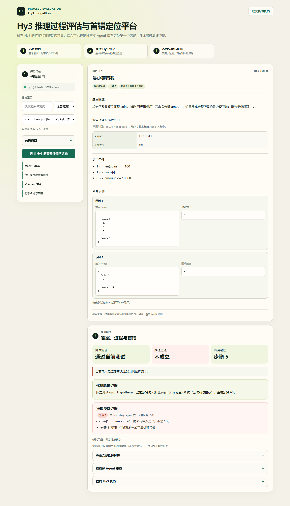
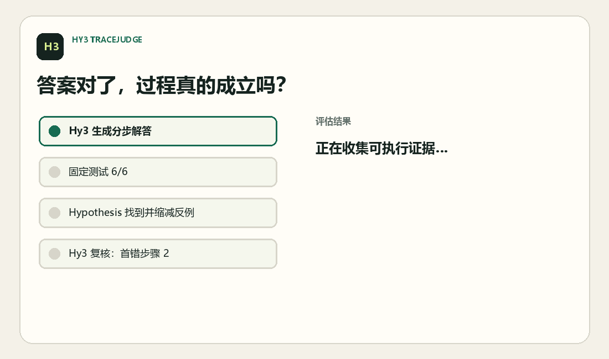

# Hy3 JudgeFlow

> Process-Level Evaluation and Error Localization with Hy3

Demo：[Bilibili 演示视频](https://www.bilibili.com/video/BV1r5Yg6JEj3/)

面向“标准答案可自动验证”的算法题，调用 **Hy3 模型**生成完整解题过程，并结合代码沙盒、固定测试、Hypothesis 属性测试、规则量表和 Hy3 多 Agent 复核，判断过程是否成立、定位首个错误步骤、归类错误，以及识别“答案正确但过程不支持结论”的样本。

> 这是个人参赛原型，不是腾讯或 Hy3 官方项目。仓库内的构造集结果用于评估器验收，不能冒充 Hy3 模型能力结果；真实模型结果必须在连接 Hy3 服务后重新生成。

## 核心能力

- **用户代码提交**：独立 `/submit` 页面用于选择题目、粘贴 Python 实现，并可选附上每行一步的解题说明；分别报告测试结果、实现逻辑、推理过程、错误代码行或步骤。生产环境强制使用 Docker，本机回环地址可显式启用受限开发沙盒。见 [代码提交使用说明](docs/CODE_SUBMISSIONS.md)。
- **完整解题**：Hy3 输出题意、算法、证明、复杂度、边界与可执行代码，而非只有最终答案。
- **双层结果验证**：固定/隐藏测试提供稳定回归，Hypothesis 自动生成输入并搜索、缩减反例。
- **过程级判断**：题目量表与五个专业 Agent 分别检查题意、算法、证明、复杂度和边界。
- **首错定位**：区分根因与下游传播错误，输出最早错误步骤及标准化错误类型。
- **结果—过程解耦**：单独识别 `final_correct=true`、`process_correct=false` 的“猜对或过程不支持结论”样本。
- **失败归属**：在线结果区分模型输出与基础设施故障并标为自动暂定；人工复核后可裁决为模型、评估器或基础设施问题。
- **可复现实验**：提供离线受控错误集、分层指标、人工抽检模板以及 JSON/JSONL/CSV 报告。

## 项目状态

| 模块 | 当前状态 |
|---|---|
| Hy3 OpenAI-compatible / TokenHub 接入 | 已实现 |
| 生产 Web/API、鉴权、限流与异步任务队列 | 已实现 |
| MySQL 持久化队列、租约恢复与 Alembic 迁移 | 已实现 |
| 固定测试、隐藏测试与 Hypothesis 差分验证 | 已实现 |
| Single / Supervisor / Bounded Swarm | 已实现 |
| 原函数与 case 接口混淆导致的首步误判修复 | 已实现，含回归测试 |
| 用户代码提交与可选步骤审查 | 已实现；生产使用 Docker，本机可信代码演示可显式启用受限本地沙盒 |
| 6 道 easy / medium / hard 种子题 | 已实现并完成五维量表校准，每档2题 |
| 65 道外部题（60 MBPP / EvalPlus + 5 TACO CodeWars） | 已接入并配置属性测试策略；与种子题合计 71 道 |
| 去重构造集与对抗轨迹、人工复核导出/汇总 | 已实现；新增正确代码＋错误证明及条件推广样本，受控与自然结果分开统计 |
| 大规模真实 Hy3 外部题评测 | 已完成 65/65；JSON、JSONL、CSV 和分析报告均已生成 |

详细技术方案见 [方案设计文档](docs/DESIGN.md)，评估原理见 [方法文档](docs/METHOD.md)，真实试运行、典型案例和离线验收见 [结果报告](docs/RESULTS.md)。

2026-09-08新增12条“最终答案正确但过程错误”的受控样本和6条正确过程对照，并输出检出、漏检、误报、真阴性和弃判计数。`hy4-preview`实际评审检出5/12，5条首错全部精确定位；7条错误过程弃判。正确过程明确评审4/6、误报0/4，另2条弃判。受控构造与自然生成结果严格分栏，详见 [专项结果](docs/RESULTS.md)。

## 界面与证据展示

首页按“选择题目 → 运行 Hy3 评估 → 查看答案、过程、首错和证据”组织流程。下面的 `coin_change` 示例展示了结果与过程解耦：候选代码通过 6/6 固定测试，并在 60 次 Hypothesis 检查中未发现代码反例；与此同时，边界专家定位到推理步骤 5，并给出具体反例：当 `coins=[1,5]`、`amount=10` 时，最优答案是 `2`，并非该步骤声称的 `10`。

界面将代码与推理证据分开显示：绿色的“代码证据”只说明当前测试覆盖内的程序行为；推理区域严格跟随三态判定，成立时显示绿色“推理审查证据”，弃判时显示黄色“待补充证据”，发现实质错误时才显示红色“反例证据”，并列出步骤、反例、Agent 来源和置信度。完整推理、多 Agent 审查和生成代码默认折叠，便于先核对结论及直接证据。

<p align="center">
  
</p>

## 最新真实评测

2026-09-10 已完成 `hy3` 对全部 65 道外部题的 Supervisor 评测：65/65 成功落盘，失败运行和待处理均为 0。最终答案正确 57/65（87.7%）；过程结论明确 58/65，其中 41 条成立、17 条不成立、7 条弃判；自动标记出 9 条“答案正确但过程不成立”样本。easy / medium / hard 的最终答案正确率分别为 92.9% / 96.2% / 76.0%，过程成立率（仅统计明确结论）分别为 75.0% / 85.7% / 56.0%，下降信号出现在 hard 层。

本轮外部题属于自然生成样本，与受控构造集分开统计；其难度仍是导入阶段的 AST 启发式，五维量表草案尚待人工抽查。自动评估器为 17/17 个负面过程给出位置，但 65 条尚未独立人工复核，因此不把该覆盖数冒充定位准确率，也不报告未经人工确认的误报率。完整口径、交叉分布和 9 条候选明细见 [65 道外部题评测报告](reports/hy3_external_20260909_report.md)，原始机器结果见同名前缀的 JSON、JSONL 和 CSV。

2026-09-07 的 6 道人工量表校准种子题试运行继续作为过程评估器的自然样本有效性验证：复核者 `xiaoxianasd` 完成 6/6 人工复核后，最终答案与过程正确率均为 5/6（83.33%），错误答案首错定位 1/1，正确过程误报 1/5。完整数据和典型案例见 [真实 Hy3 分层过程评估报告](reports/hy3_seed_stratified_20260907_report.md)。

当前回归结果：Python **225 passed / 2 skipped**，Node 判定与渲染测试 **14 passed**，并通过 JavaScript 语法检查；模型切换、任务恢复、代码提交和三态证据界面已完成本地浏览器可视验收。真实复跑 `mbpp_Mbpp/123` 在一次生成中返回完整 JSON，随后由固定测试、Hypothesis 和 5/5 明确的 Agent 审查定位到步骤 2 的实现错误。本机没有 Docker CLI，Docker 镜像重建仍需在部署环境执行。

## 快速开始：Windows 一键运行

双击项目根目录的 `Hy3_TraceJudge.bat`，即可通过菜单完成环境安装、Hy3 检查、Web 前后端启动、离线验收、真实批量评测和项目测试。

也可以在 CMD 中直接调用子命令：

```cmd
Hy3_TraceJudge.bat start
Hy3_TraceJudge.bat doctor
Hy3_TraceJudge.bat fixtures
Hy3_TraceJudge.bat benchmark
Hy3_TraceJudge.bat test
Hy3_TraceJudge.bat database
```

启动 Web 后会自动打开 `http://127.0.0.1:8765`；承载后端日志的 CMD 窗口必须保持打开。

网页左侧“模型设置”可在 `hy3` 与 `hy4-preview` 之间逐任务切换，也可填写 TokenHub API Key。“检查模型”会执行一次小型真实推理，而不只检查模型列表，因此能提前识别 401/403、额度不足和 HTTP 429 限流。选择 `hy4-preview` 时默认使用 Single 单评审以减少预览模型的并发调用，仍可在高级设置中手动改回多 Agent。模型 Key 仅保存在当前浏览器标签页和任务进程内存中，不写入任务数据库、结果或状态响应；留空时使用服务端 `.env` 中的 `HY3_API_KEY`。MySQL 队列只持久化所选模型名和临时凭据标记。若服务在任务完成前重启，浏览器 Key 会按设计失效，任务明确报错并要求重新提交。

运行中的任务编号同时写入当前页面 URL 和 `sessionStorage`。刷新页面或重新打开该 URL 后，界面会继续查询原任务，并显示排队时间、运行时间及“生成、固定测试、属性测试、Agent 审查、结果汇总”等实际阶段。任务完成后 URL 仍可用于复核 MySQL 中保存的结果。



此 GIF 为早期版本流程演示，尚未包含本次新增的用户代码提交分区。

## 一次评估会发生什么

```text
题目
  └─ Hy3 /v1/chat/completions（生成默认 reasoning_effort=low，避免内部推理耗尽最终 JSON 预算）
       ├─ 题意 / 算法 / 证明 / 复杂度 / 边界 / 代码
       ├─ 固定公开 + 隐藏测试
       ├─ Hypothesis 生成、差分验证并缩减反例
       ├─ 可解释规则量表逐步核验
       └─ Supervisor 并行分派 5 个 Hy3 专业 Agent（审查默认 reasoning_effort=high）
            ├─ 题意 / 算法 / 证明 / 复杂度 / 边界专家
            ├─ 确定性 Supervisor 汇总最早根因
            └─ Swarm 模式：仅在冲突时追加一次 Hy3 仲裁
                 └─ 最终正确性、过程正确性、首错、错误类型
```

Hypothesis 不是只用于项目单测：它位于产品评估主链中。候选代码即使通过预置用例，仍会与参考实现进行属性化差分；发现失败后保留缩减反例，从而检测“恰好过测试但实现逻辑有缺陷”。

网页中的“Hypothesis 自动测试输入上限”表示**每道题最多尝试生成多少组候选输入**。它不是题目数、训练样本数或 Agent 数。数值越大，发现隐蔽实现错误的机会通常越高，但执行时间也会增加；交互演示推荐 `60`，正式评测可提高到 `200–500`。

## 1. 安装

要求 Python 3.10+：

```bash
python -m venv .venv
# Windows: .venv\Scripts\activate
# Linux/macOS: source .venv/bin/activate
python -m pip install -e .
```

复制环境配置：

```bash
# Windows PowerShell
Copy-Item .env.example .env
# Linux/macOS
cp .env.example .env
```

默认连接本机 Hy3 OpenAI 兼容服务：

```dotenv
HY3_BASE_URL=http://127.0.0.1:8000/v1
HY3_API_KEY=EMPTY
HY3_MODEL=hy3
HY3_TIMEOUT_SECONDS=180
HY3_MAX_TOKENS=8192
HY3_SOLVE_REASONING_EFFORT=low
HY3_REVIEW_MAX_TOKENS=12288
HY3_REVIEW_REASONING_EFFORT=high
```

腾讯云 TokenHub（广州站）使用：

```dotenv
HY3_BASE_URL=https://tokenhub.tencentmaas.com/v1
HY3_API_KEY=控制台中新轮换的密钥
HY3_MODEL=hy3
```

客户端会自动识别 TokenHub，并使用其 Chat API 的顶层 `reasoning_effort` 参数；自托管 Hy3 则使用 vLLM/SGLang 的 `chat_template_kwargs` 扩展。

## 2. 启动 Hy3 模型 API

按 [Hy3 官方仓库](https://github.com/Tencent-Hunyuan/Hy3) 部署。官方 vLLM 示例的核心启动参数如下（Hy3 是 295B MoE，官方建议 8 张大显存 GPU）：

```bash
vllm serve tencent/Hy3 \
  --tensor-parallel-size 8 \
  --speculative-config.method mtp \
  --speculative-config.num_speculative_tokens 2 \
  --tool-call-parser hy_v3 \
  --reasoning-parser hy_v3 \
  --enable-auto-tool-choice \
  --port 8000 \
  --served-model-name hy3
```

也可把 `.env` 指向任意提供该 OpenAI 兼容接口、且实际加载 Hy3 的远端服务。先验连接：

```bash
tracejudge doctor
```

## 3. 运行应用

Web/API（开发模式）：

```bash
tracejudge serve --port 8765
```

浏览器打开 `http://127.0.0.1:8765`。首页用于选择题目并运行 Hy3 推理评估；用户代码提交位于 `http://127.0.0.1:8765/submit`。后者固定使用一次专用审查，不使用首页的 Supervisor/Swarm 选项。

Web 端使用版本化 `/api/v1` 协议：提交评估后立即得到任务编号，再轮询任务状态，避免 Hy3 长耗时请求持续占用 HTTP 连接。MySQL 保存任务、租约、重试状态和最终结果，服务重启后仍可查询；MySQL 8 的 `SKIP LOCKED` 支持多 Worker/多实例安全抢占。生产环境还会强制 API 密钥、有限队列、提交限流、请求大小限制、安全响应头与隐藏测试脱敏。完整部署方式见 [生产 Web/API 文档](docs/PRODUCTION.md)，队列细节见 [MySQL 任务队列文档](docs/DATABASE.md)。

- `supervisor`（默认）：生成 1 次，5 个专业 Agent 并行审查，共 6 次 Hy3 调用；
- `swarm`：在 Supervisor 基础上，发现冲突或错误时最多追加 1 次仲裁；
- `single`：兼容原有基线，生成 1 次、通用审查 1 次。

专业 Agent 并行执行可以降低等待时间，但不会减少 TokenHub 计费调用数。固定测试与 Hypothesis 的执行结果是硬证据，语言 Agent 不能抹去已发现的反例。

CLI 完整流程：

```bash
tracejudge list
tracejudge solve --problem coin_change --review-mode supervisor --hypothesis-examples 80 --output reports/coin_change.json
```

真实 Hy3 分层基准：

```bash
tracejudge benchmark --source hy3 --review-mode supervisor --hypothesis-examples 60 --output reports/hy3_benchmark.json
```

### 扩展外部题集（MBPP+ / HumanEval+）

种子集之外，可以从 EvalPlus 导入函数级外部题扩大真实模型评测的分层样本：

```bash
python scripts/import_evalplus.py            # 自动下载（需网络）并沙盒验证后导入
python scripts/import_evalplus.py --source mbpp --max 120
```

导入题写入 `data/problems_external.json`，标记 `tier: external`：

- 每题的参考实现与测试都会在项目沙盒中实际执行验证，失败即拒绝导入；
- 保留上游 `source_statement`，同时生成明确的 `adapter_contract`：原题直接参数调用会按参数名装入 `case` 字典，并统一由 `solve_case(case)` 执行；
- Solver、专业 Agent 与 Supervisor 使用同一份标准化题面，不会把已声明的接口适配误判为“步骤1题意误读”；
- `rubric/gold_steps` 为空，过程判定依赖 Hy3 多 Agent 证据；最终答案由固定测试和按函数配置的 Hypothesis 差分验证共同校验；
- 难度为 AST 复杂度启发式，需人工复核；
- fixtures 构造集验收仍然只用 6 道原创种子题，不受外部题影响；
- 真实基准可用 `--tier seed|external|all` 控制范围，例如 `tracejudge benchmark --source hy3 --tier external --limit 30`。

不依赖模型服务的评估器验收：

```bash
tracejudge benchmark --source fixtures --hypothesis-examples 20
```

后者使用受控错误和金标准标签，输出标为 `evaluator_validation_fixtures`；默认离线模式只验证执行与弃判。加 `--hy3-review` 才会实际调用 Hy3 验证语义定位，人工复核须单独完成。

## 4. 题集与数据栈

当前已接入网页的题库为 **71 道**：6 道原创题、60 道通过 EvalPlus 导入的 MBPP 题，以及 5 道 TACO CodeWars 函数级 hard 题。下表中的其他数据集是扩展规划或研究参考，不表示已经全部集成，也不用于训练模型。

当前可离线运行的种子集包含 6 道原创参数化题，按 easy / medium / hard 分层；每题具有公开测试、隐藏测试、参考实现、标准过程、规则量表和一个人工审查的受控错误。运行：

```bash
python scripts/prepare_data.py
```

会生成带 SHA-256 指纹与固定 split ID 的 `data/processed/*.jsonl`。完整扩展数据栈记录在 [sources.json](data/manifests/sources.json)：

| 层 | 数据 | 用途 |
|---|---|---|
| 主题集 | TACO | 算法题、参考实现、测试、难度 |
| OOD | LiveCodeBench | 时间切分、降低污染 |
| 执行推理 | CRUXEval | 代码输入/输出推理 |
| 测试增强 | EvalPlus | 边界测试设计参考 |
| 过程元评测 | ProcessBench | 首错定位 |
| 过程元评测 | PRMBench | 错误步骤与类型 |
| 研究参考 | PRM800K、BIG-Bench Mistake、Verify-then-Generate | 步骤监督与验证方法 |

上游大数据不直接提交。清单同时记录许可证和需要逐题复核的来源；不能因为聚合仓库使用开源许可证就自动假定每一道抓取题目可重新分发。

## 5. 判定与指标

- **测试验证通过**：固定测试全过，属性测试可靠完成且未找到差分反例；如果后续导入尚未配置策略的新题，则只能说明固定测试通过。验证服务故障时保留 `null`，不代表算法错误。
- **过程成立**：没有错误证据，并且所需评审已给出覆盖目标步骤的明确正面意见；离线词汇规则不能确认过程成立，必须有语义复核。评审缺失、低置信度或意见待核实时为 `null`。这是当前证据下的评估结论，不是形式化证明。
- **首错定位**：Supervisor 取执行/反例和专业 Agent 中证据支持的最早步骤；词汇量表仅作提示。Swarm 可在完整复核后撤回专家误报，但不能抹去确定性反例。纯代码错误记在推理步骤之后的“实现步骤”。
- **答案正确但过程不成立**：`final_correct=true` 且 `process_correct=false`。
- **定位准确率**：错误答案样本中，预测首错步骤与人工金标准完全一致的比例。
- **误报率**：人工确认过程成立且答案正确、且评估器给出明确结论的样本中，被误判为过程错误的比例；必须同时报告评估覆盖率。未知不算误报，也不能用高弃判率掩盖能力不足。

错误分类包括题意误读、概念错误、算法错误、定理误用、条件遗漏、计算错误、跳步、循环论证、复杂度错误、幻觉、实现错误和格式错误。完整设计见 [方法报告](docs/METHOD.md)，当前构造集验收见 [结果报告](docs/RESULTS.md)。

以下核心输出字段说明适用于 Hy3 自动解题模式；用户代码提交的三态判定（正确 / 错误 / 未确定）、代码行定位和未提交步骤的处理见 [代码提交说明](docs/CODE_SUBMISSIONS.md)：

| 字段 | 含义 |
|---|---|
| `final_correct` | 当前测试验证结果：`true / false / null`；不是对所有输入的正确性证明 |
| `process_correct` | 当前证据下成立 / 不成立 / 证据不足：`true / false / null` |
| `process_status` | 自动解题：`valid / invalid / uncertain` |
| `unsupported_correct` | 仅两项结论明确时计算；测试通过而过程错误为 `true`，任一未知则为 `null` |
| `first_error_step` | 当前最早定位的错误步骤；位置未知则为 `null`，不是默认第 1 步 |
| `localization_status` | `localized / unlocalized / uncertain / not_applicable` |
| `review_coverage` | 所需、已完成、结论明确的模型评审数量 |
| `error_types` | 标准化错误类型列表 |
| `orchestration` | 专业 Agent 意见、冲突、仲裁和调用用量 |

## 6. 测试与安全边界

```bash
python -m unittest discover -s tests -v
```

候选代码统一通过 `SandboxExecutor` 执行。默认 `local` 后端供 Windows 开发和单元测试使用，包含 AST 策略、受限 builtins、输入/输出上限和强制超时，但它不是宿主机安全边界。生产环境必须使用一次性 Docker 后端：

```bash
docker build -f sandbox/Dockerfile -t hy3-process-sandbox:py3.12 .
```

```dotenv
APP_ENV=production
SANDBOX_BACKEND=docker
ALLOW_UNSAFE_LOCAL_EXECUTION=false
SANDBOX_DOCKER_IMAGE=hy3-process-sandbox:py3.12
```

Docker 后端不挂载宿主目录，并启用无网络、只读根文件系统、非 root、CPU/内存/PID、临时目录和输出限制。`APP_ENV=production` 时本地后端会被强制拒绝，不能静默降级。完整威胁模型、构建和验收方式见 [安全沙盒文档](docs/SANDBOX.md)。Web/API 默认只监听 `127.0.0.1`，上线时通过 TLS 反向代理发布；生产配置样例见 `.env.production.example`。

## 目录

```text
hy3_tracejudge/       Hy3 客户端、多Agent编排、沙盒、Hypothesis、评估器、生产 API
migrations/           MySQL/Alembic 数据库结构迁移
data/problems.json    可运行种子题集与金标准过程
data/manifests/       外部数据栈、许可和抽样计划
data/annotations/     人工抽检模板
scripts/              数据准备与 Demo 生成
tests/                单元测试与参考实现属性测试
reports/              机器可读结果（运行后生成）
docs/                 方法与案例报告
```

## 文档

- [用户代码提交：使用方式、判定边界与安全配置](docs/CODE_SUBMISSIONS.md)
- [方案设计：架构、数据流、Agent 编排与接口](docs/DESIGN.md)
- [安全沙盒设计、生产配置与验收](docs/SANDBOX.md)
- [生产 Web/API：鉴权、异步任务、限流与部署](docs/PRODUCTION.md)
- [MySQL 持久化任务队列：租约、重试、迁移与运维](docs/DATABASE.md)
- [过程评估方法与有效性验证](docs/METHOD.md)
- [当前结果与典型案例](docs/RESULTS.md)
- [题集与数据栈](data/README.md)
- [界面重设计与响应式验收记录](design-qa.md)

## 更新日志

### 2026-09-10：可恢复交互、模型切换与证据界面修复

- Web 端支持在 `hy3` 与 `hy4-preview` 间逐任务切换，并使用仅保存在当前标签页的 TokenHub API Key 进行真实连通性检查。
- 任务编号写入 URL 与会话存储，刷新后继续轮询；页面显示排队、生成、固定测试、属性测试、多 Agent 审查和汇总阶段及耗时。
- 本机回环地址可通过 `ALLOW_UNSAFE_LOCAL_EXECUTION=true` 显式启用受限本地代码提交；生产环境仍强制 Docker，且不会静默降级。
- 推理证据卡改为严格三态配色；评审弃判直接显示完成数、明确结论数和弃判阶段，避免把“调用完成”误读为“结论明确”。
- 解题生成默认使用 `reasoning_effort=low`，过程审查保持 `high` 并使用独立 token 预算，避免 Hy3 把全部生成预算耗在内部推理而没有最终 JSON；截断失败返回可操作的错误码。
- 接入 5 道 TACO CodeWars hard 题后，网页题库共 71 道；相关参考实现和属性策略均纳入回归。
- 本次完整回归为 Python **225 passed / 2 skipped**、Node **14 passed**，JavaScript 语法检查通过；另完成真实 Hy3 生成与 Supervisor 全链路复跑。

### 2026-09-07：可恢复基准评测与完整属性测试覆盖

- 真实 Hy3 批量评测按“答案生成、验证完成”两个阶段原子落盘；中断后使用 `--resume` 跳过完成项并复用已生成答案，避免重复调用模型。
- `--retry-failed` 可重试调用失败或评审不可用的记录，并由 `--max-attempts`、`--retry-delay` 控制次数和间隔；题目、参数或实现版本不一致时拒绝误续跑。
- 为全部 60 道 MBPP / EvalPlus 外部题补齐显式 Hypothesis 输入策略与输入域说明；连同 6 道种子题，66 道题均可进行属性化差分验证。
- 修正外部题 `mbpp_Mbpp/123` 的入口函数、参数和期望值，并为返回集合的 `mbpp_Mbpp/111` 增加无序比较，避免题库适配错误制造假失败。
- 评测 JSON、JSONL、CSV 增加运行状态和尝试次数，README 与评估流程文档同步记录升级用法。
- 本次离线验收：Python **189 passed / 2 skipped**，Node 页面测试 **22 passed**；跳过项为需显式启用的真实 MySQL 集成测试。

### 2026-09-07：证据判定修复与人工复核流程

- 关键词仅作为审查提示，修复正确否定被判错、关键词堆砌被判成立的问题；无语义评审时保留未知。
- 参考程序逐用例异常不再污染差分标准答案，Swarm 可在完整复核后撤回专家误报。
- 构造集去重并加入对抗样本；新增 `audit-export` / `audit-summary`，以记录指纹绑定独立人工结论，统计定位率、误报比例和覆盖率。
- 真实基准支持 `--per-difficulty` 等量分层选题，统计附带 Wilson 95% 区间；CSV 保留调用失败原因。
- 操作步骤见 [评估与人工复核流程](docs/EVALUATION_WORKFLOW.md)。无需新依赖或迁移；运行中的 Web/Worker 需重启，历史结果应重新评估。

### 2026-09-03：统一三态判定与验证覆盖展示

- **统一判定入口**：自动解题的 Single、Supervisor、Swarm 与离线规则评估共用证据汇总；`process_correct` 保留 `true / false / null`，不再把未发现可定位错误等同于过程正确。
- **证据不足会明确提示**：评审失败、低置信度、步骤覆盖不全或接口误判意见被过滤但未完成复核时，页面显示“证据不足”；明确错误意见缺少有效位置时显示“不成立 / 尚未定位”。确定的测试失败不会被评审故障或模型意见抹去。
- **诚实展示测试覆盖**：Hypothesis 分别显示未配置、未执行、验证异常、发现反例、预算内未发现反例；展示实际检查次数及评审完成数。此条记录的是当时状态；当前 71 道题均已配置明确策略。
- **统计保留未知状态**：未知样本不计为正确、错误、已发现错误或误报；准确率同时报告有效样本数和覆盖率。JSON/CSV 保留三态及定位状态，详见 [判定协议与设计依据](docs/VERDICTS.md)。
- **部署影响**：本次不增加依赖或数据库迁移；默认模式调用数不变，Swarm 仍最多增加一轮仲裁。不回写历史结论。重启 Web 与独立 Worker、刷新页面后，对题目重新评估即可使用新规则。
- **本次验证**：Python 全量测试 **96 passed / 2 skipped**（跳过真实 MySQL 集成）；Node 页面状态测试 **8 passed**，JavaScript 语法与补丁检查通过。真实 Hy3、Docker、MySQL 的端到端流程以及真实浏览器布局未在本轮验收。

### 2026-09-03：首步误判修复与用户代码提交

#### 修复“几乎所有题目都被判为第一步错误”的已知问题

此前，部分 MBPP / EvalPlus 导入题使用原始函数参数描述题意，而平台要求实现 `solve_case(case)`。评审器将这两种等价接口的差异误认为“题意理解错误”，导致大量本可成立的解答被定位到第 1 步。

本次修复包括：

- 保留原始题面 `source_statement`，为导入题显式声明 `adapter_contract`，说明原函数参数与 `case` 字典字段的对应关系；已有题库加载时也会补齐契约，不必重新导入。
- Hy3 解题器、分步评审与 Supervisor/Swarm 仲裁共用接口契约；专业 Agent 使用实际目标步骤编号，标准过程未标注本身不构成错误。
- 在 Single 与 Supervisor 汇总中识别并过滤符合已知特征的“接口适配误判”，保留过滤原因和冲突记录；固定测试失败、差分反例以及其他真实错误仍然有效。
- 增加接口契约和首步误判回归测试，验证合法的 `solve_case(case)` 解答不再因该已知问题被直接判错。

**修复范围：针对接口混淆导致的系统性误判，并不是取消第 1 步检查，也不代表所有题目、所有模型判断都保证正确。** 真正的题意误读仍应被报告，评估器仍需通过人工抽检持续验证。

#### 新增“提交我的代码”独立评估页面

用户现在可以选择已有题库中的题目，粘贴自己的 Python 实现，并按需附上分步解题说明。系统直接验证提交内容，不先让 Hy3 重写代码或补造推理过程。

- **独立入口**：`/submit` 页面与模型评测首页分离；代码草稿按题目分别保存在页面内存中，避免切题时混用。
- **分别给出结论**：测试结果、实现逻辑审查、推理过程审查分别展示；问题可定位到用户步骤或代码行，并给出依据与修正建议。
- **支持仅交代码**：未提供步骤时，`process_correct=null`，页面显示“未提交步骤”，不将缺少说明误判为过程错误；低置信度或无效定位也不会强行下结论。
- **复用验证设施**：固定/隐藏测试、已配置的 Hypothesis 策略，以及一次专用 Hy3 代码与过程审查；测试通过不等于实现对所有输入都正确。
- **安全与持久化**：新增 `POST /api/v1/code-submissions`，沿用鉴权、限流、请求大小限制和任务队列；用户代码强制 Docker 隔离执行，MySQL 保存提交内容以支持重启恢复。

详细操作、API 示例和判定边界见 [用户代码提交说明](docs/CODE_SUBMISSIONS.md)。

#### 升级前须知与验证状态

- **MySQL 用户必须先升级数据库**：停止旧 Web/Worker，执行启动器菜单 **7** 或 `Hy3_TraceJudge.bat database`，将结构升级到 `0004`，再使用菜单 **1** 启动 Web。`0003` 增加可空的 `submission_json`，`0004` 仅增加模型名和临时凭据标记，不保存模型 API Key；迁移不删除历史任务，部署前建议备份数据库。
- **用户代码执行模式**：正式部署必须构建 Docker 镜像并配置 `SANDBOX_BACKEND=docker`。仅在非生产环境、服务绑定回环地址且显式设置 `SANDBOX_BACKEND=local`、`ALLOW_UNSAFE_LOCAL_EXECUTION=true` 时，允许本机演示自己的可信代码；页面会持续显示风险提示。
- **回归结果**：本次 Python 离线测试为 **72 passed / 2 skipped**；跳过项为需要显式启用的真实 MySQL 集成测试。JavaScript 语法检查通过。新增提交分区的浏览器测试已编写，但浏览器交互及 Docker + 真实 Hy3 完整链路尚未完成本次验收，不应视为已生产就绪。
- **配套改进**：界面改为专业化标题，选题后可查看完整题面、输入格式、约束、公开示例和来源；改进 Hy3 非法 JSON 的错误归类，并在任务失败提示中附上任务编号。

## License

本项目采用 [Apache License 2.0](LICENSE)。外部数据集仍须分别遵守各自许可证与再分发要求。
