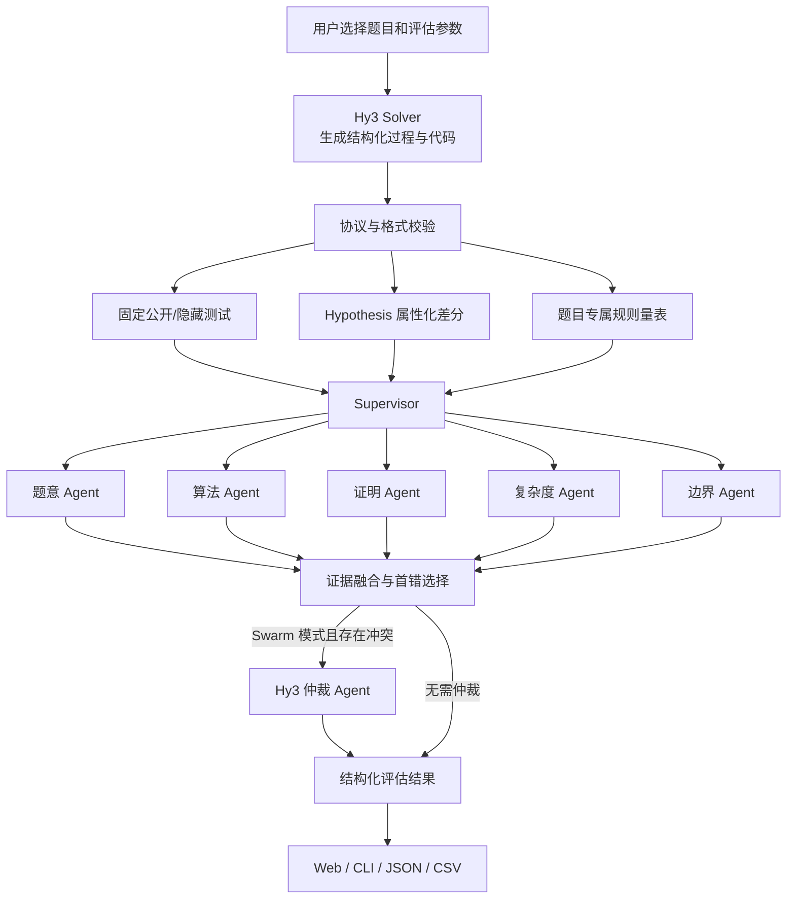

# TraceJudge 方案设计文档

## 1. 项目目标

TraceJudge 是一个面向可验证算法任务的 Hy3 应用。系统不仅回答“代码是否通过测试”，还回答以下问题：

1. 最终答案是否正确；
2. 推理链中的每一步是否能够成立；
3. 最早的根因错误出现在哪一步；
4. 错误属于哪一类；
5. 是否存在“结果正确，但推理过程无法支持结果”的情况。

当前版本聚焦算法竞赛与代码功能题，因为该领域能够提供参考实现、固定测试和可自动生成的输入。它是应用与评估系统，不训练或微调 Hy3。

## 2. 设计原则

- **可执行证据优先**：固定测试和 Hypothesis 反例不被语言模型意见覆盖。
- **结果与过程分离**：分别计算 `final_correct` 和 `process_correct`。
- **定位根因而非症状**：后续步骤继承早先错误时，仍归因于最早错误步骤。
- **多源交叉验证**：结合格式、规则、执行、属性测试和 Hy3 语义审查。
- **有限 Agent 协作**：Agent 数量和仲裁轮次固定，控制延迟、成本和不可预测性。
- **可追溯与可复现**：保留原始答案、测试结果、反例、Agent 判断和模型用量。

## 3. 需求映射

| 任务要求 | TraceJudge 实现 |
|---|---|
| 输出完整解答过程 | Hy3 按五阶段 JSON 协议生成推理与代码 |
| 标准答案与自动判定 | 参考实现、公开/隐藏测试、差分执行 |
| 过程正确性判定 | 题目量表 + 五个专业 Agent + 确定性证据融合 |
| 错误步骤定位 | 候选错误统一映射到步骤，选择最早证据充分的根因 |
| 错误类型归类 | 12 类标准错误标签 |
| 正确答案但过程错误 | 两项结论明确时，`final_correct is True` 且 `process_correct is False`；否则未知 |
| 定位准确率与误报率 | 受控错误轨迹、金标准首错、人工抽检记录 |
| 分难度结果 | easy / medium / hard 分层统计 |
| 可运行应用 | 本地 Web、CLI 与 Windows BAT 启动器 |

## 4. 系统架构



### 4.1 组件职责

| 组件 | 文件 | 职责 |
|---|---|---|
| Hy3 Client | `hy3_tracejudge/hy3_client.py` | TokenHub/自托管端点、生成、分阶段审查、仲裁 |
| Answer Protocol | `hy3_tracejudge/protocol.py` | 结构化答案协议、JSON 提取、字段校验 |
| Executor | `hy3_tracejudge/executor.py` | 隔离子进程运行候选代码和固定测试 |
| Property Testing | `hy3_tracejudge/property_testing.py` | 生成输入、参考实现差分、反例缩减 |
| Multi-Agent | `hy3_tracejudge/multi_agent.py` | 专家并发、证据融合、冲突与有界仲裁 |
| Evaluator | `hy3_tracejudge/evaluator.py` | 最终正确性、过程正确性、首错和错误类型 |
| Interfaces | `cli.py`、`web.py` | CLI、HTTP API 与 Web Demo |
| Reporting | `reporting.py` | JSON、JSONL 和 CSV 结果落盘 |

## 5. 核心数据协议

### 5.1 题目记录

每道题至少包含：

```text
id, title, statement, difficulty,
input_schema, constraints, function_name,
public_tests, hidden_tests, reference_solution,
gold_steps, rubric, boundary_cases
```

`reference_solution` 是差分测试的标准程序。动态输入的 `expected` 由参考程序计算；固定用例的 `expected` 直接存储在题目记录中。

### 5.2 Hy3 答案

```json
{
  "reasoning_steps": [
    {"id": 1, "stage": "understanding", "title": "题意与建模", "content": "..."},
    {"id": 2, "stage": "algorithm", "title": "算法", "content": "..."},
    {"id": 3, "stage": "proof", "title": "正确性证明", "content": "..."},
    {"id": 4, "stage": "complexity", "title": "复杂度", "content": "..."},
    {"id": 5, "stage": "boundary", "title": "边界条件", "content": "..."}
  ],
  "complexity": {"time": "O(...) ", "space": "O(...)"},
  "edge_cases": ["..."],
  "code": "def solve_case(case): ...",
  "final_answer": "..."
}
```

代码被视为第六个隐式步骤。当文字过程成立而执行失败时，错误定位到该实现步骤。

### 5.3 评估结果

```json
{
  "final_correct": true,
  "process_correct": false,
  "unsupported_correct": true,
  "first_error_step": 2,
  "error_types": ["theorem_misuse"],
  "criteria": [],
  "execution": {},
  "hypothesis": {},
  "orchestration": {}
}
```

## 6. 评估 Pipeline

### 6.1 结构校验

首先检查答案是否为 JSON 对象，是否包含推理步骤、复杂度、边界、代码和最终答案。格式无法解析时立即输出 `format_error`，避免后续模块基于残缺数据产生误判。

### 6.2 固定测试

候选代码在新的隔离 Python 子进程中执行。公开和隐藏测试均参与最终正确性计算；Web 返回结果时隐藏用例的输入输出不会直接泄露。

当前隔离层用于评测稳定性，不是面向恶意代码的安全沙盒。对公网部署时应增加容器、无网络、只读文件系统以及 CPU/内存限制。

### 6.3 Hypothesis 属性化差分

Hypothesis 根据题目约束生成输入。每个输入分别运行：

```text
参考实现(case) → expected
候选实现(case) → actual
expected 与 actual 比较
```

若结果不同，Hypothesis 继续 shrink，尽量得到更短、更容易解释的反例。“最大样本数”是**单道题的自动生成输入预算**，不是题库规模、训练数据量或 Agent 数量。找到反例后可能提前结束，缩减过程也可能产生额外执行。

### 6.4 规则量表

每个阶段拥有题目专属的正向证据词和可选禁用陈述：

- 关键词和禁用陈述只作为语义审查提示，不直接判对错；
- 语义 Agent 需要判断否定、引用、等价表达和实际推导，不能根据词汇匹配作结论；
- 规则结果保留在报告中，方便人工复核。

### 6.5 Multi-Agent 审查

Supervisor 并行调用五个角色隔离的 Hy3 专家：

| Agent | 审查范围 | 典型错误 |
|---|---|---|
| `understanding_agent` | 题意、输入输出、约束、建模 | 题意误读、条件遗漏 |
| `algorithm_agent` | 算法、状态转移、数据结构、定理条件 | 算法错误、定理误用 |
| `proof_agent` | 不变量、完备性、必要性与充分性 | 跳步、循环论证 |
| `complexity_agent` | 分析与代码实际开销是否一致 | 复杂度错误 |
| `boundary_agent` | 空输入、重复值、不可达等 | 边界遗漏 |

Agent 必须输出阶段、审查步骤、合法性、候选首错、错误类型、理由、证据、继承根因和置信度。单个 Agent 不负责最终裁决。

## 7. 编排模式

| 模式 | 模型调用 | 适用场景 |
|---|---:|---|
| `single` | 1 次生成 + 1 次通用审查 | 低成本基线、连通性演示 |
| `supervisor` | 1 次生成 + 5 次并行专业审查 | 默认评估、职责清晰、延迟适中 |
| `swarm` | Supervisor + 最多 1 次仲裁 | 复杂样本、专家意见冲突分析 |

Swarm 是“有界”的：没有开放式循环讨论，只允许一次仲裁。这样能够限制成本，并使每次运行的最大调用数可预测。

## 8. 证据融合与首错定位

系统把每条问题证据转换为：

```text
(step, error_type, source, confidence)
```

处理顺序如下：

1. 收集专业 Agent 问题和执行失败，保留词汇提示供复核；
2. 检查模型意见的置信度、理由及步骤覆盖；未评审的步骤阻止正面结论；
3. 只有可靠执行失败或反例保持为不可抹去的确定性证据；
4. 采用最小 `step` 作为首错；
5. 同一步骤有多种类型时保留并列类型；
6. Swarm 仲裁不能抹去确定性证据；覆盖全部步骤且没有缺失检查时，可以撤回专家误报。负面仲裁不能把已定位首错后移。

最终正确性定义为：

```text
final_correct = fixed_tests_all_passed AND no_hypothesis_counterexample
```

过程与结果关系为：

```text
unsupported_correct = null if either verdict is unknown
                      else (final_correct is true AND process_correct is false)
```

判定已升级为三态协议：缺失评审不再隐式通过，错误存在与错误定位分别记录；准确率需同时报告有效样本分母及覆盖率。以上二值表达式只适用于测试已可靠完成的情况，详细口径与兼容规则以 [三态判定与验证覆盖](VERDICTS.md) 为准。

## 9. 错误分类体系

| 类型 | 含义 |
|---|---|
| `format_error` | 输出无法解析或缺少必需字段 |
| `problem_misread` | 误解题意、目标或输入输出 |
| `concept_error` | 核心概念或状态定义错误 |
| `algorithm_error` | 算法、转移或数据结构错误 |
| `theorem_misuse` | 定理、贪心或公式使用条件不成立 |
| `condition_omission` | 漏掉约束或边界条件 |
| `calculation_error` | 算术、代数或下标错误 |
| `unjustified_jump` | 关键推导缺少支持 |
| `circular_reasoning` | 使用待证结论作为前提 |
| `complexity_error` | 复杂度结论与实现不一致 |
| `hallucination` | 引用不存在的事实、定理或 API |
| `implementation_error` | 文字过程成立但代码行为错误 |

## 10. 有效性验证设计

### 10.1 受控轨迹

当前 6 道题的构造轨迹已去重，并增加关键词堆砌、循环论证和否定错误示例的对抗样本。样本数量以实际生成报告为准；构造标签不等于独立人工复核。

### 10.2 指标

- **最终答案准确率**：`final_correct` 的样本比例；
- **过程正确率**：`process_correct` 的样本比例；
- **首错定位准确率**：错误答案中预测首错与金标准完全一致的比例；
- **误报率**：人工确认过程成立的正确答案中，被判为过程错误的比例；
- **真实问题占比**：被标记的正确答案中，人工确认确有过程问题的比例；
- **错误类型分布**：按最早根因统计，避免重复计算传播错误。

构造集只验证评估器，不代表 Hy3 的真实能力。正式结论必须运行真实 Hy3 基准并进行独立人工抽检。

## 11. HTTP 与 CLI 接口

### 11.1 HTTP

| 方法 | 路径 | 用途 |
|---|---|---|
| `GET` | `/api/health` | 检查 Hy3 endpoint 与模型 |
| `GET` | `/api/problems` | 获取可选题目 |
| `POST` | `/api/run` | 生成答案并完成一次评估 |

`POST /api/run` 请求示例：

```json
{
  "problem_id": "coin_change",
  "hypothesis_examples": 60,
  "review_mode": "supervisor"
}
```

### 11.2 CLI

```bash
tracejudge doctor
tracejudge list
tracejudge solve --problem coin_change --review-mode supervisor
tracejudge evaluate --problem coin_change --answer answer.json --hy3-review
tracejudge benchmark --source fixtures
tracejudge benchmark --source hy3 --review-mode swarm
tracejudge serve --port 8765
```

## 12. 配置、成本与部署

模型连接由 `.env` 控制：

```dotenv
HY3_BASE_URL=https://tokenhub.tencentmaas.com/v1
HY3_API_KEY=YOUR_API_KEY
HY3_MODEL=hy3
HY3_TIMEOUT_SECONDS=180
HY3_MAX_TOKENS=8192
HY3_TEMPERATURE=0.9
HY3_TOP_P=1.0
```

API Key 不得提交到 Git。默认 Supervisor 模式会为一道题产生 6 次聊天请求；Swarm 在需要仲裁时最多 7 次。五个审查请求并发执行能降低墙钟时间，但不会减少 token 用量。

## 13. 已知边界与后续路线

当前边界：

- Web 只支持选择仓库内题目，尚未提供任意题目的可视化导入表单；
- Hypothesis strategy 已覆盖 6 道种子题和 65 道外部题；外部题使用逐题显式策略注册表，并记录版本与输入域；
- 参考实现本身仍需要来源审计和独立验证；
- Python 子进程隔离不是安全级沙盒；
- Multi-Agent 语义判断可能受提示词和模型随机性影响；
- 真实模型评测规模与人工抽检仍需在参赛提交前完成。

建议扩展顺序：

1. 增加 JSONL 题库导入和 schema 校验；
2. 为新题生成或人工编写 Hypothesis strategy；
3. 扩展到 TACO、LiveCodeBench 等经许可的数据子集；
4. 固定模型参数、数据版本和运行清单，生成真实分层报告；
5. 对全部 `unsupported_correct` 和抽样正常样本进行双人复核；
6. 使用容器化安全沙盒替换当前稳定性隔离层；
7. 增加重试、限流、缓存与调用成本预算。

## 14. 关键设计决策

| 决策 | 原因 |
|---|---|
| 不训练模型 | 任务重点是应用与过程评估，现有 Hy3 API 足以完成角色化审查 |
| 参考实现作为动态 Oracle | 自动获得新输入的 `expected`，避免手工列举全部测试 |
| Hypothesis 而非纯随机测试 | 支持约束生成、失败复现与最小反例缩减 |
| 专业 Agent 并行 | 降低串行审查延迟，并减少职责互相污染 |
| Python Supervisor 最终融合 | 保留确定性规则，防止语言模型任意覆盖执行证据 |
| 有界 Swarm | 获得冲突仲裁能力，同时限制调用次数和对话发散 |
